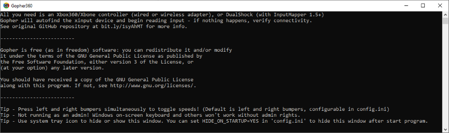

Original repository
======
ReadMe of original repository contains information about purpose of this software, compatible controllers, key bindings and other core functionality.
https://github.com/Tylemagne/Gopher360

Problems of original repository
======
1. It is abandoned. Any update after 2017.
2. Release version at 'Releases' page is different from last master commit. For example, executable does not contain application icon, despite the fact that it is present in the project.
3. Application must be open or minimized for work. At the same time, the user does not interact with the application window, he does not need it. In my opinion, an unnecessary application on the taskbar is annoying.

Improvements 
======
1. Icon of original project is restored:
2. A tray icon has been added, which can be clicked to hide or open the application.
3. Removed colors from console background. The messages in the console now have a more conventional style.

This repository is focused on adding features without changing core functionality of original software. Only few necessary files have been changed.

Build Instructions
======
Just open project in Visual Studio and build it. I am used VS2019 with Win10 SDK and C++17 to build it.

